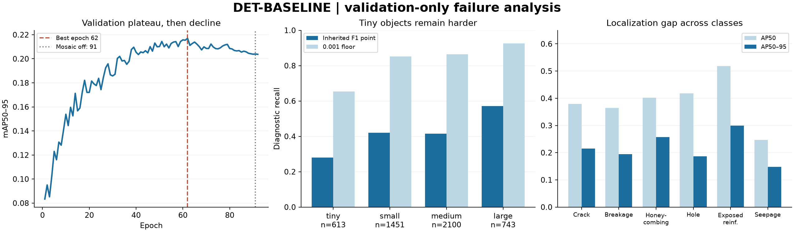

# DET-BASELINE closeout and validation failure analysis

Project: AegisInspect — Autonomous Multimodal Drone Inspection System. Workstream 02; Laptop 1. Analysis date: 2026-09-13 17:35 MDT (UTC−06:00).

**Closeout passes. Validation failure analysis is complete within the approved scope. DET-IMPROVED-01 is a proposal only and must be deferred for Monday.** Keep the verified DET-BASELINE checkpoint as the presentation baseline. This is not a DET-FINAL freeze, deployment threshold decision, test evaluation, or training authorization.

The guarded best.pt replay exactly reproduces all four canonical aggregate values and all 49 recovered confusion-matrix cells. It supplies full-precision class metrics and per-image predictions without altering the original run. Dominant issues are weak confidence separation, localization/instance extent, and tiny/thin-object misses. Size matters, but tiny+small are 45.4% of misses, not a majority; Seepage also fails on medium/large objects.

## A. Baseline provenance confirmation

Canonical repository: `C:\Users\Aritra\Documents\autonomous-drone-infrastructure-inspection`. Frozen run: `C:\Users\Aritra\Documents\autonomous-drone-infrastructure-inspection\outputs\training\defect_detection\DET-BASELINE`.

| Item | Verified evidence |
| --- | --- |
| Training branch | chat02/detector-training |
| Run-stored and current Git SHA | 8ee410771c8be794d366e5e014f14f748edca97f |
| Run Git state | dirty=true; only ?? outputs/training/defect_detection/DET-BASELINE/; tracked diff empty |
| Model | YOLO26s, detection, pretrained yolo26s.pt; six classes |
| Initialization acquisition | Recorded HTTPS acquisition from official ultralytics/assets v8.4.0 release; no download during analysis |
| Initialization SHA-256 | 646f8bc3fe0a656803d95c294f7852321748cb29d13466a1af8862e2db384a1b |
| Requested / resolved configuration | requested_config.json / resolved_config.json; args.yaml agrees on the critical training/validation settings |
| Dataset | GYU-DET V3 baseline-v1; configs/data/gyu_det_v3_baseline_v1.yaml |
| Development-only YAML | Frozen development_data.yaml contains train and val lists, no test/download key |
| Split membership | 8305 train / 1040 valid; exact frozen selections and approved list/manifest hashes verified |
| Seed / determinism | 42 / true |
| Optimizer | SGD + Nesterov; momentum .937; weight decay .0005 |
| Learning rate | lr0=.01, lrf=.01, linear; 3 warmup epochs; nbs=64, resolved accumulate=16 |
| Image / batch | 640 / train batch 4; validation batch 8, rect=true, pad=.5 |
| Epochs | 100 requested; 92 completed; best epoch 62 |
| Early stopping | patience=30; 92−62=30, no better fitness after 62 |
| Augmentation | mosaic=1; close_mosaic=10; scale=.5; translate=.1; fliplr=.5; hsv_h/s/v=.015/.7/.4; mixup/cutmix/copy_paste=0; Albumentations disabled |
| Runtime switches | BF16 training; workers=0; cache=false; no label-disk cache; resume=false |
| Packages | Python 3.11.15; Ultralytics 8.4.145; torch 2.14.0+cu130; torchvision .29.0+cu130; NumPy 2.4.6; Pillow 12.3.0 |
| CUDA/runtime | cuda:0; PyTorch CUDA runtime 13.0; driver 591.94 reports CUDA capability 13.1; cuDNN 92400; nvcc absent from PATH |
| GPU | NVIDIA GeForce RTX 4070 Laptop GPU, 8188 MiB; compute capability 8.9 |
| Duration | Log: 25.248 h; CSV cumulative 90893.4 s; train_validation_seconds=90976.359778; fit_seconds=91061.247827 (different timing boundaries) |
| best.pt SHA-256 | 4c7a32c9b40c0795bbe59aca5952a0631e1524ec731ad2c7441cccb1b44f71c3 |
| last.pt SHA-256 | 7cb24d3d7397b045330fbf24f2aa54949cfc055c4931cc45ef4eb2302dff1982 |
| Integrity at start | 47 frozen files inventoried and SHA-256 hashed; both checkpoints and all stored training-source/approved manifest/list hashes pass |

Class mapping: 0 Crack; 1 Breakage; 2 Honeycombing; 3 Hole; 4 Exposed Reinforcement; 5 Seepage. Both checkpoints are optimizer-stripped; best.pt metadata has epoch=-1 and best_fitness=null. Therefore epoch 62 is established by results.csv plus trainer.log, not inferred from stripped checkpoint fields. The checkpoint date is consistent with its earlier save. All recorded package versions and the full resolved configuration are in [baseline_provenance.json](../../../outputs/analysis/defect_detection/DET-BASELINE/baseline_provenance.json).

The resolved `exist_ok=true` is the frozen wrapper's pre-created output directory policy, while requested config says false. The wrapper explicitly refuses an existing run before creating it. This recorded distinction is not a hash mismatch or a new overwrite permission.

## B. Exact validation evidence and learning curves

These are **validation** metrics on 1040 images / 4907 instances. They are not held-out test metrics.

| Metric | Canonical final best.pt value |
| --- | --- |
| metrics/precision(B) | 0.47223142096534465 |
| metrics/recall(B) | 0.4130733263020834 |
| metrics/mAP50(B) | 0.3884237740581788 |
| metrics/mAP50-95(B) | 0.21699306833671056 |

Historical final per-class values exist only at the logged/plot rounded precision. They are retained in [original_per_class_rounded.csv](../../../outputs/analysis/defect_detection/DET-BASELINE/original_per_class_rounded.csv). The following values are rounded for readability from a **new validation replay**; complete floating-point values are in [per_class_metrics.csv](../../../outputs/analysis/defect_detection/DET-BASELINE/per_class_metrics.csv). Reproduction of the aggregate does not turn newly computed class precision into recovered historical precision.

| Class | GT | P | R | AP50 | AP50–95 | AP75 |
| --- | --- | --- | --- | --- | --- | --- |
| Crack | 366 | 0.463455 | 0.390710 | 0.379450 | 0.215283 | 0.234116 |
| Breakage | 2129 | 0.451366 | 0.380460 | 0.364853 | 0.194931 | 0.190700 |
| Honeycombing | 479 | 0.340728 | 0.559499 | 0.402117 | 0.257198 | 0.284517 |
| Hole | 228 | 0.550431 | 0.412281 | 0.418557 | 0.186759 | 0.126640 |
| Exposed Reinforcement | 1327 | 0.606258 | 0.486812 | 0.518388 | 0.299816 | 0.308406 |
| Seepage | 378 | 0.421150 | 0.248677 | 0.247178 | 0.147972 | 0.156184 |

Replay: same verified best.pt, Ultralytics 8.4.145, 640, batch 8, device 0, workers 0, rect=true/pad=.5, FP16, conf=.001, iou=.7, max_det=300, nms=false, augment=false. It reuses the reviewed ReadOnlyDetectionDataset and exact valid manifest/list, bypassing automatic dataset discovery, cache/repair, optional integrations and downloads. The final trainer validator retained FP16 (`quantize=16`) from training-time CUDA validation; source inspection informed the replay setting. This achieved exact aggregate reproduction. See [inference_config.json](../../../outputs/analysis/defect_detection/DET-BASELINE/validation_replay/inference_config.json) and [completion.json](../../../outputs/analysis/defect_detection/DET-BASELINE/validation_replay/completion.json). Canonical speed: about .6/8.4/.4 ms per image preprocess/inference/postprocess. Replay about .3/8.0/.3 ms is an analysis observation, not a controlled throughput benchmark.

The best CSV row at epoch 62 contains P=.46749, R=.41435, AP50=.38836, AP50–95=.21702. These are training-time EMA/autocast metrics, distinct from the subsequent final best.pt validation above. Installed `Metric.fitness` weights only AP50–95. AP50 itself peaks at epoch 60 (.38868); that does not change the best checkpoint selection.

| Measurement | Epoch 1 | Epoch 62 | Epoch 92 | 62→92 |
| --- | --- | --- | --- | --- |
| train/box_loss | 1.87583 | 1.60730 | 1.43154 | -0.17576 |
| train/cls_loss | 4.11411 | 1.82505 | 1.18442 | -0.64063 |
| train/l1_loss | 0.01496 | 0.01136 | 0.01112 | -0.00024 |
| val/box_loss | 1.68904 | 1.61830 | 1.66069 | +0.04239 |
| val/cls_loss | 2.95436 | 2.07933 | 2.25122 | +0.17189 |
| val/l1_loss | 0.01645 | 0.01552 | 0.01595 | +0.00043 |
| metrics/precision(B) | 0.29030 | 0.46749 | 0.45364 | -0.01385 |
| metrics/recall(B) | 0.17668 | 0.41435 | 0.42345 | +0.00910 |
| metrics/mAP50(B) | 0.16109 | 0.38836 | 0.37450 | -0.01386 |
| metrics/mAP50-95(B) | 0.08337 | 0.21702 | 0.20372 | -0.01330 |

Learning is strong early: mean AP50–95 is .115887 in epochs 1–10, .184136 in 21–30, .207549 in 41–50, and .213482 in 53–62. The broad plateau starts around 50–62; this is a descriptive interval, not a fitted change point. Afterwards means decline to .210669 (63–72), .209341 (73–82), and .205444 (83–90). Recall plateaus near .41 while precision fluctuates near .46–.47.

After the best epoch, training box/classification losses fall 10.9%/35.1%, while validation box/classification losses rise 2.6%/8.3%; AP50–95 falls .01330 absolute (6.1% relative). This supports late overfitting/generalization deterioration. It does not establish that the architecture is globally underfit. Difficult small-object and semantic regimes remain under-resolved, but low AP alone is not evidence that more identical epochs will help. No nonfinite losses or catastrophic optimization instability were recorded; early warmup loss fluctuations and precision jitter do not show divergence.

Mosaic shutdown is at zero-based epoch 90, displayed epoch **91**, because max_epochs=100 and close_mosaic=10. Only epochs 91–92 completed without mosaic. From 90 to 91, training classification loss falls 1.46146→1.23719 and L1 rises .01019→.01144, while AP50–95 changes .20378→.20399 then .20372 at 92. The abrupt training-loss shift is consistent with the changed augmentation distribution; two observations cannot establish a benefit or failure of mosaic shutdown. The decline predates it. Patience=30 matches the log and 92−62 exactly. More unchanged epochs are not supported by these curves.

Original artifact paths, all beneath `C:\Users\Aritra\Documents\autonomous-drone-infrastructure-inspection\outputs\training\defect_detection\DET-BASELINE`: `results.csv`, `results.png`, `labels.jpg`, `train_batch0.jpg`, `train_batch1.jpg`, `train_batch2.jpg`, `train_batch186930.jpg`, `train_batch186931.jpg`, `train_batch186932.jpg`. The training mosaics show substantial cropping/scale variation; late batches are single-image transforms. They supply context, not a causal augmentation ablation. Numeric tables: [learning_curve_windows.csv](../../../outputs/analysis/defect_detection/DET-BASELINE/learning_curve_windows.csv), [selected epochs](../../../outputs/analysis/defect_detection/DET-BASELINE/learning_curve_selected_epochs.csv), [summary](../../../outputs/analysis/defect_detection/DET-BASELINE/learning_curve_summary.json).

## C. Confusion, PR and qualitative findings

Original matrix paths: `C:\Users\Aritra\Documents\autonomous-drone-infrastructure-inspection\outputs\training\defect_detection\DET-BASELINE/confusion_matrix.png` and `C:\Users\Aritra\Documents\autonomous-drone-infrastructure-inspection\outputs\training\defect_detection\DET-BASELINE/confusion_matrix_normalized.png`. Rows are predicted classes; columns are ground truth. Normalization is per true-class column; the background column shows the composition of unmatched predictions, not the probability of damage in a clean image.

**Matrix and headline P/R are different operating definitions.** The original/replayed matrix uses confidence **>0.001** and matching IoU **>0.45**, with class-agnostic geometry matching. It is not the commonly assumed 0.25-confusion matrix. Headline P/R use the evaluator's automatically chosen smoothed mean-F1 grid point, **0.18618618618618618**, at IoU .50. The F1 plot rounds this to .186. AP integrates ranked predictions across IoU .50–.95. Existing prediction mosaics display scores >.25, so their visible omissions are not counts at .186 or .001. No deployment threshold was tuned or selected.

| GT class | GT count | Correct at matrix setting | Missed to background | Other-class match | Predicted background FP |
| --- | --- | --- | --- | --- | --- |
| Crack | 366 | 288 | 27 | 51 | 23108 |
| Breakage | 2129 | 1398 | 199 | 532 | 64245 |
| Honeycombing | 479 | 307 | 21 | 151 | 20667 |
| Hole | 228 | 96 | 41 | 91 | 3907 |
| Exposed Reinforcement | 1327 | 1008 | 169 | 150 | 28008 |
| Seepage | 378 | 186 | 94 | 98 | 7391 |

The complete integer matrix was recovered from the new replay, and every cell matches visual transcription of the original non-normalized PNG. The 147326 background false positives are low-score proposals at the AP collection floor; do not present them as deployment false alarms. Breakage contributes 64245 (43.6%) and Honeycombing 20667 (14.0%). There are 551 GT unmatched to background at this generous floor and 1073 foreground class-confusion matches.

Strongest confusions: true Breakage→Honeycombing **297** (14.0% of Breakage GT); Honeycombing→Breakage **114** (23.8%); Reinforcement→Breakage **98**; Breakage→Seepage **85**; Breakage→Reinforcement **68**; Seepage→Breakage **65**; Hole→Reinforcement **61** (26.8% of Hole GT). Seepage has the highest background miss fraction, **94/378=24.9%**, versus Hole 41/228=18.0%; Seepage also has 98 wrong-class matches. At the inherited analysis point, Seepage has 284/378 missed GT: 159 have a correct match at the lower floor, 102 have no >=.1 overlap at the analysis point, with the remaining categories smaller. Thus its main practical issue is missed/weakly scored detection; class confusion also contributes, particularly at very low confidence. A single classification-only explanation is inadequate.

Original PR paths beneath `C:\Users\Aritra\Documents\autonomous-drone-infrastructure-inspection\outputs\training\defect_detection\DET-BASELINE`: `BoxPR_curve.png`, `BoxP_curve.png`, `BoxR_curve.png`, `BoxF1_curve.png`. All four were inspected. [Curve samples](../../../outputs/analysis/defect_detection/DET-BASELINE/curve_diagnostic_points.csv) and the replay's `curves.npz` preserve numeric behavior.

- **Seepage:** worst AP50 (.247178), recall .248677, and low F1 over the curve. Lowering confidence increases recall sharply at the expense of precision; this does not repair weak discrimination or ambiguous texture.
- **Honeycombing:** recall .559499 but precision .340728 at the automatic common point; high recall persists farther up the confidence axis than other classes. Its precision remains lower than other classes over much of the useful range. At the diagnostic point, 516 FP versus 270 TP include 314 unmatched/ambiguous and 83 high-overlap wrong-class predictions; reviewed stained-wall examples support overprediction/texture overlap.
- **Hole:** precision .550431 is respectable and AP50 ranks second, despite being rarest. AP75 falls to .126640 and AP50–95 is .186759: localization is a stronger concern than assuming every rare-class failure is classification. High-confidence precision is jagged as very few detections remain; no across-run instability was measured.
- **Breakage:** dominant GT volume yields the largest absolute FN/FP totals, but only mid/low per-class AP. It is both confused with Honeycombing and missed in small/clustered regions; dominance does not guarantee good learning.
- **Reinforcement:** strongest AP overall, but its tiny subset still has 71.9% FN. **Crack:** thin/segmented boxes and overlapping GT extents make IoU sensitive. Precision approaching one at extreme confidence is not useful success: recall is then near zero, and curve interpolation with no predictions must not be treated as perfect detection.

For object-level analysis only, predictions are filtered at the inherited .186186 point then matched greedily by descending IoU>=.50, one-to-one within class, in native EXIF-oriented coordinates. This yields **2079 TP / 2828 FN / 2267 FP**, a micro recall of 0.4237. These integer diagnostics differ from interpolated macro P/R and from assignment over all low-score candidates. They are not replacements for canonical metrics. GT error categories use a priority rule: low-floor match, wrong-class overlap, same-class localization, weak overlap, then no overlap. Causes can coexist; [overlapping_error_flags.json](../../../outputs/analysis/defect_detection/DET-BASELINE/overlapping_error_flags.json) records additional flags. The 262 duplicate candidates overlap an already accounted-for same-class object; overlapping GT may complicate that designation. We did not alter NMS, which is disabled for this end-to-end model.

Original qualitative artifacts: `C:\Users\Aritra\Documents\autonomous-drone-infrastructure-inspection\outputs\training\defect_detection\DET-BASELINE/val_batch{0,1,2}_labels.jpg` and corresponding `_pred.jpg`. New review plates below use replay predictions at .186186 and unchanged approved annotations. Crops are display-only comparisons, not extra model inputs. Review is purposive, not a prevalence estimate.

| Validation image | Assessment | Observation |
| --- | --- | --- |
| 8622.JPG | MODEL FAILURE relative to approved GT | Hole GT #4 is visible as a circular opening but missed. It occupies about 6.9 x 8.3 pixels at 640, within a larger Breakage region. Loss of rim/detail is visible in the display comparison; a higher-resolution model benefit remains untested. |
| 9217.jpg | MODEL FAILURE relative to approved GT | Reinforcement GT #10 is about 2.0 x 16.6 pixels at 640. Thin hanging metal is clearer in the source crop and is missed at the analysis point. Several neighboring small targets are also missed; density and size are confounded. |
| 11986.jpg | MODEL FAILURE plus possible boundary ambiguity | A confidence ~0.39 Crack box extends substantially beyond the narrower annotated crack segment. A better-localized lower-score proposal exists. The Seepage prediction on the pale patch is unmatched to an annotation; its physical validity cannot be settled from this image alone. |
| 9194.jpg | MODEL FAILURE plus visual ambiguity | All three annotated Seepage streaks are missed at the analysis point. Broad Honeycombing boxes cover stained/textured wall regions. The streaks remain visible at 640, so this is not solely a tiny-object problem. Low contrast and competing textures are plausible contributors, not proven causes. |
| 9199.jpg | POSSIBLE ANNOTATION / VISUAL AMBIGUITY | Three GT regions labeled Breakage coincide with visibly exposed metal; the model predicts Exposed Reinforcement. This is a measurable label-based class confusion, but the visual semantics overlap. Two Honeycombing GT regions also receive one broad predicted region. Do not declare the annotations wrong. |
| 12001.jpg | POSSIBLE ANNOTATION / VISUAL AMBIGUITY | A large Honeycombing GT box covers broadly textured concrete; the prominent prediction is Breakage. The image does not establish an unambiguous class boundary. A lower-score Honeycombing proposal accounts for the diagnostic score-suppressed label. |
| 12297.jpg | LOCALIZATION / DUPLICATE CANDIDATES with annotation overlap | The same crack system has five overlapping GT boxes and multiple overlapping predictions, including a broad oversized box. Redundant prediction candidates exist, but overlapping annotations make a blanket duplicate/annotation-error judgment inappropriate. |
| 12254.jpg | DENSE-SCENE COUNTEREXAMPLE | The image contains 59 annotations. The model correctly matches 39 and misses 20 at the analysis point, retaining many exposed-reinforcement targets. Density does not imply universal failure, and the count remains below max_det=300. |
| 12305.jpg | LOW-SOURCE-RESOLUTION LIMITATION | The 550 x 413 source contains 28 annotations; 14 match and 14 are missed. Higher input size cannot recover absent original detail. Multiple adjacent reinforcement instances and broad Breakage boxes complicate matching. |
| 11992.jpg | MODEL FAILURE plus unmatched-region ambiguity | Four clustered annotated Breakage boxes on the left are missed; the source itself is blurred there. Predictions also cover unannotated dark/rust-colored regions on the right. These are benchmark false positives, but they are not proof of physically undamaged surfaces. |

Ten full review plates are in the analysis `examples/` directory; their exact source paths, GT indices and assessments are in [qualitative_review.csv](../../../outputs/analysis/defect_detection/DET-BASELINE/qualitative_review.csv) and `qualitative_example_candidates.json`. No labels were corrected. Benchmark unmatched predictions are not automatically physically false defects.

## D. Size, imbalance, density and source resolution

M1 source: `src/data/validators/gyu_eda.py` (relative-area bins, not COCO pixel-area AP categories). Tiny <.001; small [.001,.01); medium [.01,.1); large >=.1. This task uses that same convention, computed from unchanged normalized annotations. Input-side lengths are approximate pre-letterbox content dimensions at a 640 long side; exact loader rounding/padding can differ by a pixel.

| Size | GT | Share of GT | TP | FN | Recall at inherited point | Recall at .001 floor |
| --- | --- | --- | --- | --- | --- | --- |
| tiny | 613 | 12.49% | 172 | 441 | 28.06% | 65.42% |
| small | 1451 | 29.57% | 609 | 842 | 41.97% | 85.11% |
| medium | 2100 | 42.80% | 873 | 1227 | 41.57% | 86.38% |
| large | 743 | 15.14% | 425 | 318 | 57.20% | 92.60% |

Tiny+small are **2064/4907=42.06%** of validation GT, close to the prior broader EDA estimate of 42.61%. They contribute **1283/2828=45.37%** of diagnostic misses and have combined recall **37.84%**. Tiny is a clear weak stratum, while small and medium aggregate recall are almost equal. Tiny+small are a substantial contributor, not a majority or an adequate explanation of every class. At the permissive floor tiny recall is still only 65.4% vs large 92.6%, so changing confidence alone cannot close the scale gap.

Class interactions are stronger than a single pooled size number: tiny/small/medium Breakage recall is **2.4% (1/41) / 26.1% (138/529) / 41.2% (507/1232)**; Crack tiny/small are each 9.1% (1/11 and 5/55); Reinforcement tiny **28.1% (115/409)** vs small **59.5% (396/665)**. Hole tiny recall is **39.3% (55/140)**, exceeding several more frequent-class strata; its medium subset is only 22 objects. Seepage medium recall remains **24.2% (52/215)** and large **38.1% (24/63)**. Tiny/small size-specific precision or AP is intentionally not reported: no defensible outside-bin GT/FP ignore protocol is implemented, and unmatched predictions cannot simply be assigned a true-object size. The required recall and FN analysis is fully available.

Minimum input side <4 pixels: **5/72=6.9%** recall; 4–8 pixels: **85/326=26.1%**; 8–16: 44.2%; 16–32: 42.4%; >=32: 44.7%. The narrowest strata are especially difficult, supporting a limited resolution hypothesis. Width/height and relative area measure different properties; a long thin crack can have medium area.

| Class | Training instances | Validation instances | Diagnostic TP | FN | FP |
| --- | --- | --- | --- | --- | --- |
| Crack | 3876 | 366 | 153 | 213 | 155 |
| Breakage | 13383 | 2129 | 810 | 1319 | 984 |
| Honeycombing | 4945 | 479 | 270 | 209 | 516 |
| Hole | 927 | 228 | 94 | 134 | 76 |
| Exposed Reinforcement | 10604 | 1327 | 658 | 669 | 407 |
| Seepage | 3864 | 378 | 94 | 284 | 129 |

Approved training annotations total **37599**, with Breakage 13383 and Hole 927: **14.44:1**. Validation imbalance is **2129:228=9.34:1**. These are the measured approved split frequencies, distinct from the prior approximate 15.62:1 broader M1 EDA statement; no data was changed to reconcile them. Hole is 2.47% of training annotations versus 4.65% of validation annotations. It is rarest but not worst AP50; Seepage has 3864 training instances and the weakest AP. Breakage's large absolute errors partly reflect its 43.39% validation instance share. Honeycombing's 4945 training instances do not prevent low precision. Frequency alone does not explain the ordering, and class-aware sampling is not selected as the first experiment. Hole localization/sample scarcity are plausible interacting factors; seed-to-seed instability is not measured.

Analysis-only density bins: sparse 1–2 boxes (341 images), typical 3–6 (472), dense >=7 (227). Recall is **52.1% / 44.6% / 38.4%** respectively. Dense images hold 48.6% of GT and 51.9% of misses, including 506 of 613 tiny targets. Within small objects, typical/dense recall is **41.8%/41.9%**; much of the density association may be composition. Dense tiny recall is 24.7% versus 46.9% in typical scenes; sparse tiny has only 9 GT. The maximum is 59 GT/image, below max_det=300. Do not infer NMS suppression or a max-det bottleneck.

Validation has **545/1040=52.40%** multi-class images, distinct from the prior 57.03% broader EDA value. Multi-class micro recall is **43.5%**, above single-class **39.3%**. GT with another box at IoU>=.1 have recall 47.5%, versus 41.2% without; this descriptive proxy does not show a simple overlap penalty. Co-located classes and redundant box extents still complicate individual scenes. Neither multi-class status nor overlap alone should be ranked as a universal failure cause.

There are **51 distinct oriented source resolutions** in validation, versus 85 in the prior overall EDA. At >=12MP (784 images), recall is 41.2%; 4–12MP (96) 41.6%; 1–4MP (116) 54.7%; <1MP (44) 46.2%. The pattern is not monotonic. >=12MP contains 81.1% of GT and 82.7% of FN; its high miss count mainly reflects exposure. Most tiny GT are in that group (569/613), with 26.5% recall. This is consistent with downscaling losses but does not isolate resolution from object size/class/source.

Observed aspect ratios max/min are at most 2; the >2 extreme bin has no validation support. Recall is 42.4% at <=1.5 and 41.4% at 1.5–2. Do not infer extreme-aspect behavior from absent samples. Source crops (8622/9217) show a plausible detail-loss mechanism at 640; the 550x413 example shows that larger inputs cannot invent missing source detail. **800 or 1024 has not been tested, and no automatic superiority claim is made.** See size/class-size, density/size, resolution/size, input-detail and aspect CSVs.

## E. Ranked failure modes

| Rank | Failure mode | Evidence / prevalence | Confidence | Addressable? |
| --- | --- | --- | --- | --- |
| 1 | Weak confidence separation and missed detections at usable precision | 57.6% of annotations missed; 72.8% of those misses have an eligible match at the floor. Different threshold matchings can reassign boxes. | High for observation, moderate/low for mechanism | Potentially model/training; lowering a threshold alone trades in many false positives. |
| 2 | Localization and instance-extent ambiguity | 28.8% of diagnostic FP in the exclusive localization category; overlaps with other GT-side failure mechanisms. | High for localization weakness; moderate for attribution | Potentially resolution/representation; ambiguous annotation policy cannot be solved by training configuration alone. |
| 3 | Tiny and thin-object misses | Tiny: 441/2828 FN (15.6%); tiny+small: 1283/2828 FN (45.4%) vs 42.1% of instances. Substantial, not the majority of all errors. | High for association, moderate for resolution hypothesis | Yes, single input-resolution change is a testable hypothesis. |
| 4 | Class/texture confusion and overprediction | 1073 off-diagonal foreground matches in original/replayed floor confusion matrix; 196/2267 diagnostic FP are high-overlap wrong-class predictions. | High for label-based counts, moderate for semantic cause | Potentially; class sampling alone is not supported as the first change. |
| 5 | Dense-scene association with misses | 51.9% of FN occur in dense scenes containing 48.6% of GT; 506/613 tiny GT are in dense scenes. | High for association, low/moderate for mechanism | Potentially, but no NMS change or separate density experiment is justified now. |
| 6 | Visual/annotation ambiguity and limited source information | Not estimated: purposive qualitative review is not a prevalence sample. | Moderate for examples; no dataset-wide annotation-error claim | Not reliably by one training setting; annotations remain untouched. |

These modes overlap; percentages are not additive. Late overfitting is an additional training-trajectory finding, not an independent per-image error category. Detailed affected classes, evidence and likely causes are in [failure_modes.json](../../../outputs/analysis/defect_detection/DET-BASELINE/failure_modes.json). Low contrast and annotation ambiguity are supported qualitatively but have no estimated dataset-wide prevalence.

## F. One proposed controlled experiment

1. **Experiment ID:** DET-IMPROVED-01.
2. **Target:** tiny/thin-object misses and localization; especially tiny Reinforcement and small Breakage. It will not necessarily repair Seepage or ambiguous semantics.
3. **Single primary change:** `imgsz: 640 → 800`, the same scalar input-size setting used in training and its validation. No P2 head, tiling, sampling change, augmentation change or sweep.
4. **Support:** tiny recall 28.1%, <4px-side recall 6.9%, within-class size gaps and inspected detail-loss examples. A 25% linear increase gives 56.25% more input pixels while retaining an otherwise identical architecture/configuration. Benefit is a hypothesis.
5. **Held fixed:** exact dataset membership, train/validation lists and annotations; same official pretrained yolo26s.pt initialization/hash; seed42/deterministic; YOLO26s architecture; SGD/Nesterov, LR schedule, all augmentations including mosaic and shutdown; batch4/nbs64, 100 requested epochs, patience30, BF16, workers0, no caches; framework/GPU; evaluator, validation-only checkpoint selection, blocked test and CODEBRIM policies. Start fresh from the original initialization, not best.pt. Full settings are in the proposal JSON.
6. **Comparison:** baseline640 versus otherwise identical800 pipeline, each best checkpoint chosen by validation AP50–95. This is the total input-resolution-setting effect; it does not disentangle training representation from inference scale. One seed does not estimate training variance.
7. **Full retraining:** yes, for that claim. A baseline-checkpoint fine-tune would change optimization history.
8. **Laptop1 runtime estimate:** 25.248h × (800/640)² = **39.45h** for 92-epoch-like duration; **42.88h** at100 epochs. Unbenchmarked planning range **32–50h**, plus **3–5h** analysis/integration reserve. Decode overhead, thermals, GPU contention and stop epoch can alter this estimate.
9. **Monday feasibility:** **not responsible to start**. Assessed Sunday 2026-09-13 17:35 -0600; exact presentation hour not supplied. Central training completion if started then: Tuesday 2026-09-15 09:02 -0600, before report/integration reserve. Even the planning lower bound runs past Monday. Preserve the completed baseline for presentation.
10. **Shorter valid test:** no short training substitute proves the full hypothesis. A separately approved paired frozen-weight640/800 validation inference can test only inference-scale sensitivity in minutes plus analysis, not retraining benefit; it was not run. Arbitrarily truncated training or fine-tuning is not promoted as DET-IMPROVED. Do not sacrifice schedule/history controls for the deadline.
11. **Validation-only success:** AP50–95 >= **0.22699306833671056** (>=.010 absolute improvement) **and** tiny+small diagnostic recall >= **0.42839147** (baseline 0.37839147 +.050), measured with unchanged bins/matching and frozen .186186 confidence for this diagnostic. This is not a deployment threshold decision.
12. **Per-class guardrails:** no class AP50–95 regression >.020 absolute; Hole AP75 must not fall >.020. Explicitly report tiny Reinforcement and small Breakage recall and all small-sample denominators; do not select solely on tiny Breakage/Crack.
13. **Stop/rollback:** engineering stop on changed data/checkpoint identity, nonfinite values, guard violation, OOM or fixed-batch auto-reduction, output collision. Keep patience30/max100. If success criteria fail, baseline remains selected; no sweep or post-hoc threshold rescue. No launch before the presentation under current timing.
14. **Risks:** runtime/latency/VRAM; 800 may still be inadequate for ~2px targets; no benefit on ambiguous or blurred source material; unchanged relative augmentations have larger pixel effects; late overfitting and single-seed/validation selection uncertainty remain.
15. **Fallback:** DET-BASELINE remains intact and is the fallback if improvement fails.

Proposal machine record: [det_improved_proposal.json](../../../outputs/analysis/defect_detection/DET-BASELINE/det_improved_proposal.json). The frozen training validator currently permits only640; an authorized future experiment would require an explicit reviewed allowance. This task makes no training/config changes. Proposal READY means ready for Control Center review, not launch authorization.

## G. Runtime and Monday decision

**Freeze the DET-BASELINE development result for Monday's presentation and defer DET-IMPROVED training.** This is distinct from freezing DET-FINAL. Even an unchanged ~25.25h rerun would consume most of the remaining Sunday/Monday interval and leave little or no presentation integration time; the proposed resolution run is longer. A rushed early-stopped manual pilot would not answer the controlled comparison. There is no evidence from this task that DET-IMPROVED is better because it was not trained or evaluated.

## H. Artifacts created and reproduction

Analysis destination: `C:\Users\Aritra\Documents\autonomous-drone-infrastructure-inspection/outputs/analysis/defect_detection/DET-BASELINE/`.
Report destination: `C:\Users\Aritra\Documents\autonomous-drone-infrastructure-inspection/docs/experiments/defect_detection/DET_BASELINE_FAILURE_ANALYSIS.md`.
Analysis code: `scripts/analysis/det_baseline_common.py`, `closeout_det_baseline.py`, `validate_det_baseline.py`, `summarize_det_baseline.py`, `render_det_baseline_examples.py`; tests: `tests/analysis/test_det_baseline_analysis.py`. No existing training code or M1 tests were changed.

The exact relative file list and SHA-256 values are in `artifact_manifest.json` at the bundle root. It includes provenance/integrity, learning tables, original rounded metrics, new full-precision metrics, confusion/curve exports, every validation prediction/GT box, object/image error tables, size/class/density/resolution strata, ten review plates, failure ranking, and proposal. Files were computed in an isolated staging tree under the current task before placement in the repository; inference_config retains the actual execution paths. These copies do not claim a different execution location. Runtime cache/settings files are excluded from the deliverable.

The analysis scripts accept `--root <repository>` and `--out <new analysis directory>`. The validation script refuses an existing replay destination, verifies canonical checkpoint hashes, runs only validation, and records settings. Use the same pinned detection environment. Synthetic tests exercise size boundaries, matching/duplicates, empty cases, weighted strata and raw/holdout guards. No training entry point is present in these scripts. Run `python -B -m pytest tests/analysis/test_det_baseline_analysis.py -q -p no:cacheprovider`. The report/qualitative judgments are reviewed findings, not generated labels.

## I. Git and safety status

Seven lightweight analysis tests passed. Initial `git diff --check` was clean and tracked diff was empty. Final status, exact created paths and final frozen-tree integrity are recorded in `safety_status.json` and the delivery manifest. No commit was made.

The pre-existing raw immutability result remains PASS:21559 files observed,18690 development files content-hashed, zero additions/removals/size/mtime/SHA changes, no .cache/.npy. This task reused that expensive hashing result and separately checked metadata for the18690 approved development files; it did not rehash all raw content or traverse held-out imagery. Final development-only metadata/inventory checking detects additions and cache files in the accessed areas. Read-only guards and output routing provide additional controls; metadata checks do not independently prove content equality if bytes are maliciously changed while preserving metadata.

The complete47-file DET-BASELINE tree is rehashed at closeout and must match its initial inventory, including paths/sizes/mtimes. best.pt/last.pt retain canonical hashes. All dataset/split configuration and training-source hashes remain verified. Held-out test content and metrics are untouched; CODEBRIM is untouched; no training, resume, sweep, label/image edit, split edit, Chat03/P19 modification or auto-commit occurred. Only approved train labels were read for frequency counts and valid images/labels for analysis.

## J. Explicit gate status

DET-BASELINE failure analysis: COMPLETE
DET-IMPROVED proposal: READY
DET-IMPROVED training authorization: NOT AUTHORIZED
GYU-DET held-out test: BLOCKED
CODEBRIM: BLOCKED
DET-FINAL: NOT FROZEN
Stop A: NOT COMPLETE
